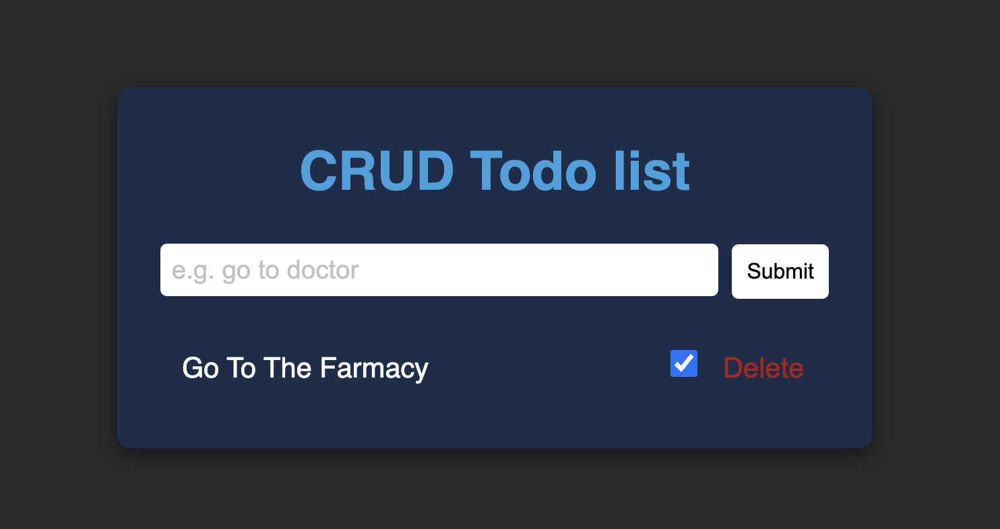

# Image gallery

> A simple todo list using json server

## Table of contents

- [Image gallery](#image-gallery)
  - [Table of contents](#table-of-contents)
  - [General info](#general-info)
  - [Screenshots](#screenshots)
  - [Technologies](#technologies)
  - [Setup](#setup)
  - [Code Examples](#code-examples)
  - [Features](#features)
  - [Status](#status)

## General info

> CRUD todo list using javaScript and json server

## Screenshots



## Technologies

- JavaScript
- HTML5
- CSS3
- VSC code

## Setup

clone the repo, run npm install, and run npm server

## Code Examples

```js
const addToDoItem = async (item) => {
	try {
		const res = await fetch('http://localhost:3000/todos', {
			method: 'POST',
			headers: {
				'Content-Type': 'application/json',
			},
			body: JSON.stringify(item),
		});
		const data = await res.json({ message: 'Items added successfully...' });
		return data;
	} catch (error) {
		return error;
	}
};

export default addToDoItem;
```

## Features

To-do list:

- Add new item
- Check item
- Delete item

## Status

Project is: _Done_
